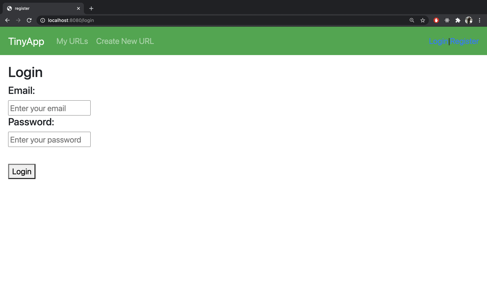
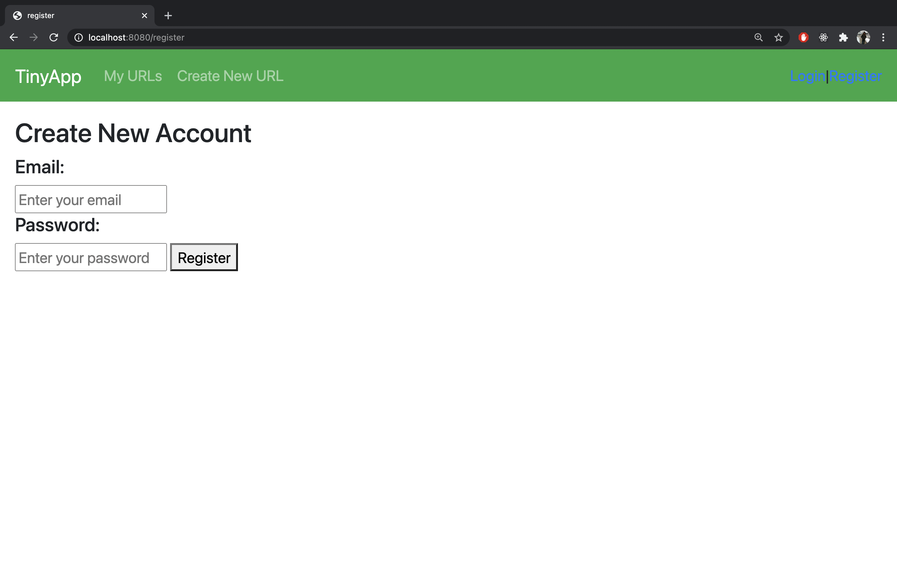
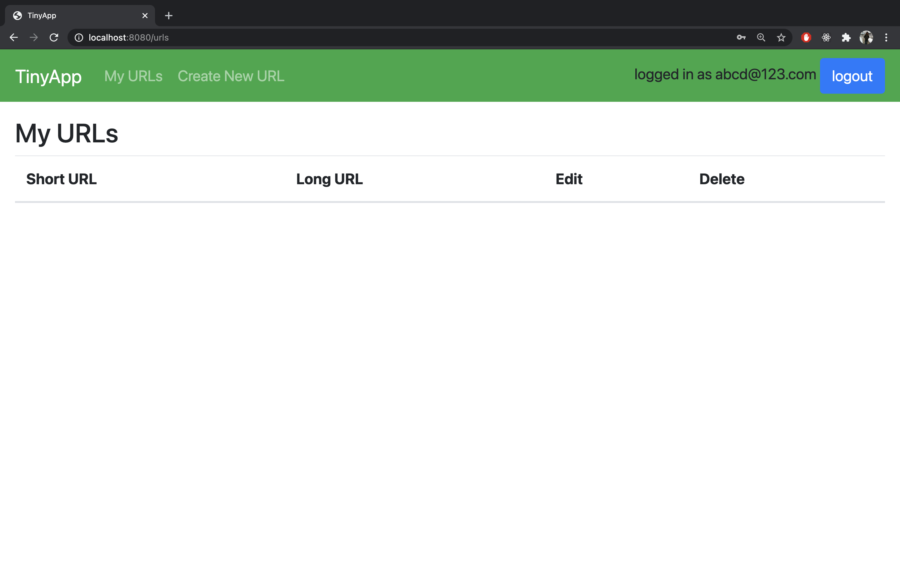
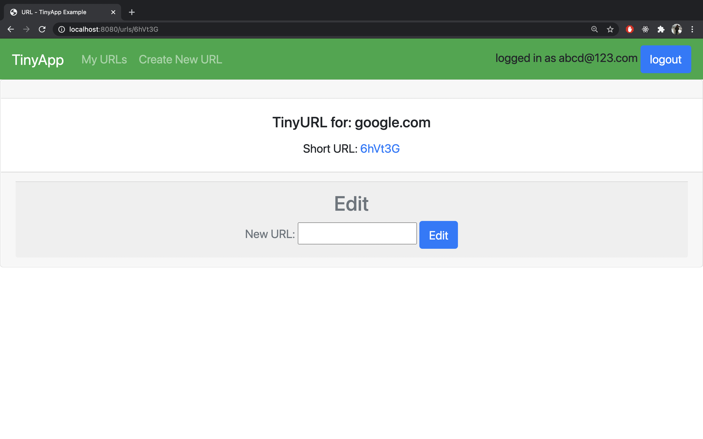
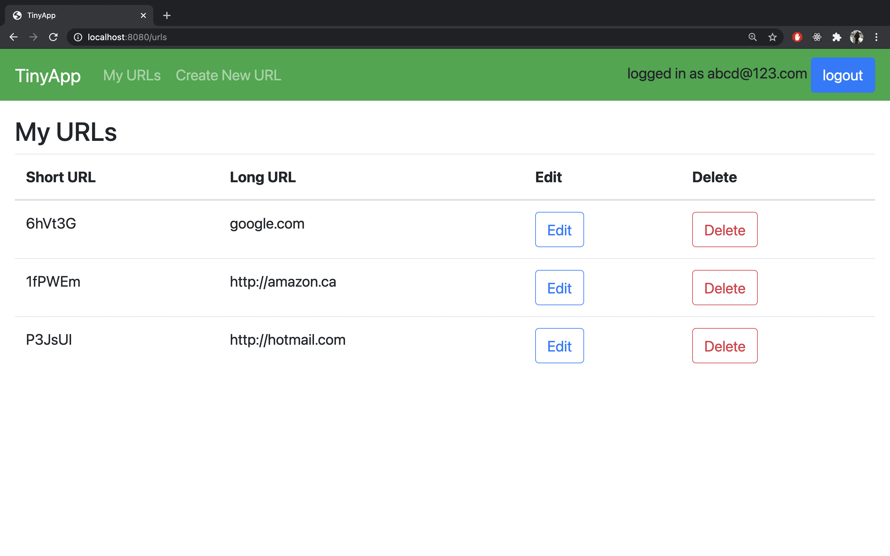

# TinyApp Project

TinyApp is a full stack web application built with Node and Express that allows users to shorten long URLs (à la bit.ly).Tiny app is equiped with security feature like encrypted password storage and encrypted cookies which enhanced security of application, also only view url created by user only and Registerd user can only use feature of shortning url.

## Final Product

### Login Page

### Register Page

### Login Home

### Edit URL Page

### My URL

## Dependencies

- Node.js
- Express
- EJS
- bcrypt
- body-parser
- cookie-session

## Getting Started

- Install all dependencies (using the `npm install` command).
- Run the development web server using the `node express_server.js` command.